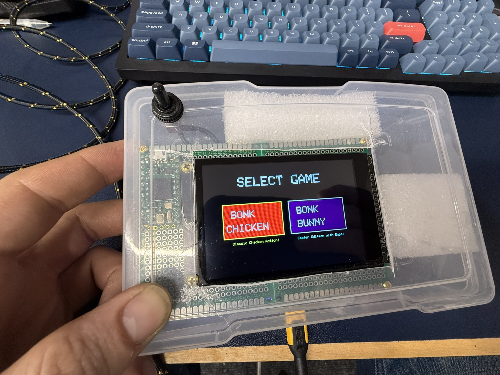

# BONK Game

BONK is a fun, interactive touchscreen game designed for Arduino-compatible microcontrollers with TFT displays. The game features various modes, including single-player and multiplayer options, with different game variants.


## Hardware Requirements

- Arduino-compatible microcontroller (tested on Teensy)
- ILI9488 TFT display
- FT6236G capacitive touch controller
- Appropriate wiring and power supply

## Game Variants

- **BONK Chicken**: The original BONK game featuring chicken characters
- **BONK Bunny**: Alternative game variant with bunny characters

| BONK Chicken | BONK Bunny |
|:------------:|:----------:|
|  |  |

## Game Modes

- **Single Player**: Test your reflexes in solo mode
- **Two Player**: Compete against a friend to see who can get the highest score

 

## Difficulty Levels

Choose between different difficulty settings to match your skill level:

- **Easy Mode**: Designed for kids and beginners, includes a "late tap" feature that gives players more time to react
- **Shred Gnar Mode**: Challenging mode for experienced players with faster gameplay

The game provides visual feedback with a green flash and center dot to register a successful "BONK" when the target is hit correctly.


## Game Mechanics

Players tap appearing objects on the screen to score points. The faster you tap, the more points you earn. Special items occasionally appear for bonus points. The game includes a timer, and players must score as many points as possible before time runs out.

### Scoring and Results

At the end of each game, the final score is displayed along with statistics on your performance.


## File Structure

- `BONK_Completed_REV4.0Frenzy.ino`: Base game with "Frenzy" mode
- `BONK_Completed_REV5.0_Multiplayer.ino`: Enhanced version with multiplayer support
- `BONK_Fixed.ino`: Bug-fixed version
- `ESP32_Teensy_41_Demo.ino`: Demo for ESP32 + Teensy 4.1 version

## Menu System

The game features an intuitive menu system for selecting game variants, modes, and difficulty levels.



## Installation

1. Install the required libraries:
   - SPI
   - ILI9488_t3
   - Wire
   - FT6236G

2. Connect your hardware according to the pin definitions in the code:
   ```
   // TFT display pins
   #define TFT_CS     10
   #define TFT_DC     9
   #define TFT_RST    8

   // Touch panel pins
   #define CTP_INT    5
   #define CTP_RST    7
   #define CTP_ADDR   0x38
   ```

3. Upload the desired `.ino` file to your microcontroller.

## Development

This game was developed to demonstrate interactive capabilities of touchscreen displays with Arduino-compatible microcontrollers. It features:

- State-based game flow
- Touch input processing
- Dynamic graphics
- Score tracking
- Timer functionality
- Multiple game modes and difficulty levels

## License

This project is open source and available for educational and recreational purposes.

## Credits

Created by VonHoltenCodes.