# 🎮 BONK Game

BONK is a fun, interactive touchscreen game designed for Arduino-compatible microcontrollers with TFT displays. The game features various modes, including single-player and multiplayer options, with multiple exciting game variants! 🚀

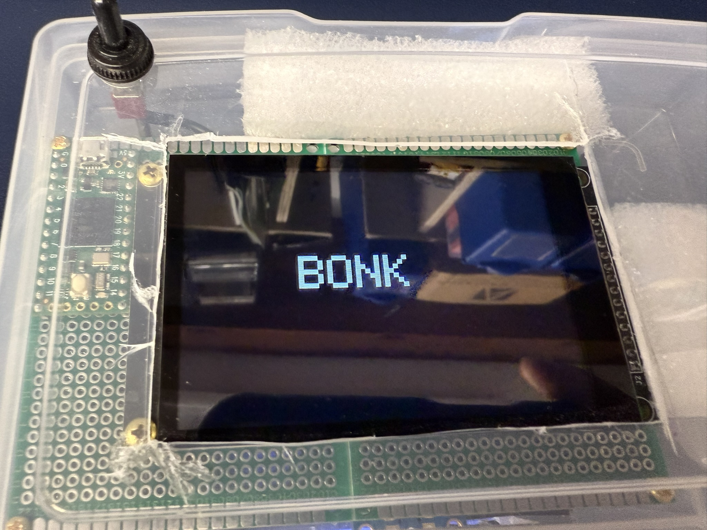

## 🔧 Hardware Requirements

- 🖥️ Arduino-compatible microcontroller (tested on Teensy)
- 📺 ILI9488 TFT display (480x320)
- 👆 FT6236G capacitive touch controller
- ⚡ Appropriate wiring and power supply

## 🎯 Game Variants

Choose from five exciting themed variants:

- 🐔 **BONK Chicken**: The original classic game featuring chicken characters and explosive special effects
- 🐰 **BONK Bunny**: Easter-themed variant with adorable bunnies and colorful eggs for special points
- 🇺🇸 **BONK Patriots**: Memorial Day/4th of July patriotic theme with American flags and firework effects!
- 🐕 **BONK Bluey**: Features Bluey and Bingo characters with red balloons that pop into colorful confetti! (Fan-made variant)
- 🐉 **BONK Dragons**: NEW! How to Train Your Dragon themed with Toothless and Light Fury, collect fish and shoot plasma blasts!

| 🐔 BONK Chicken | 🐰 BONK Bunny |
|:----------------:|:--------------:|
| 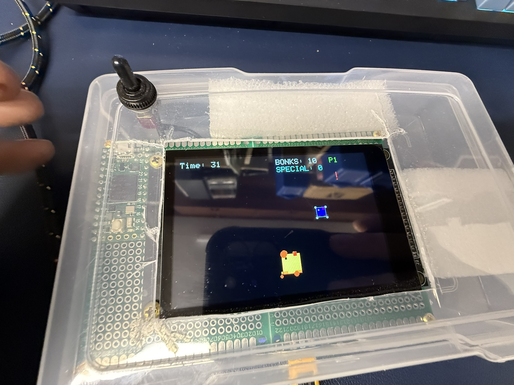 | 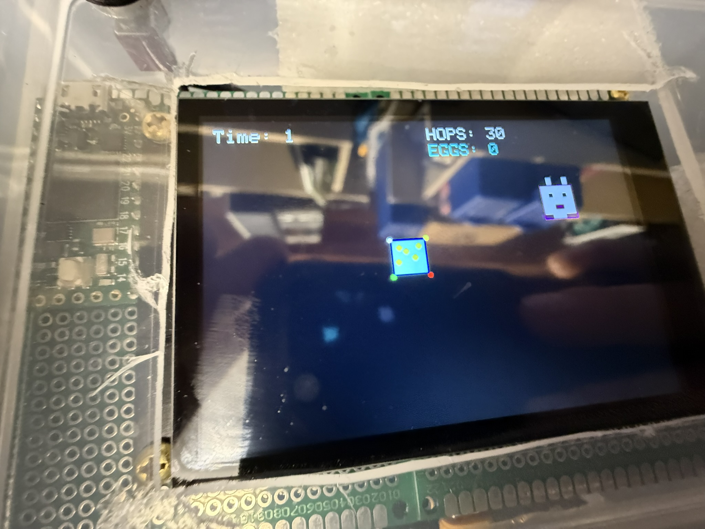 |

| 🐕 BONK Bluey | 🐕 BONK Bingo |
|:----------------:|:--------------:|
| 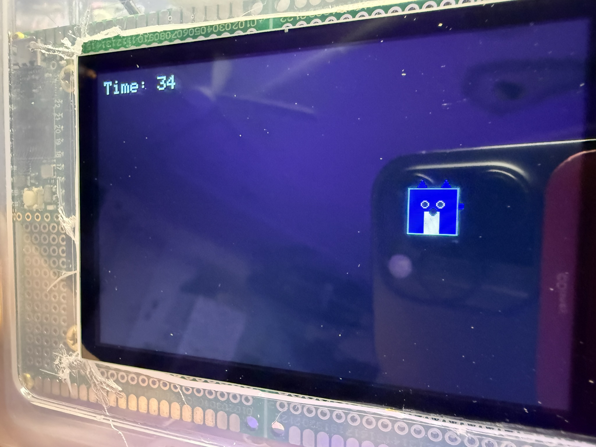 | 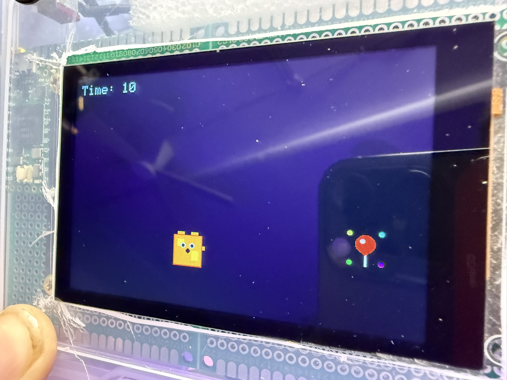 |

| 🐉 BONK Toothless | 🐉 BONK Light Fury |
|:----------------:|:--------------:|
| 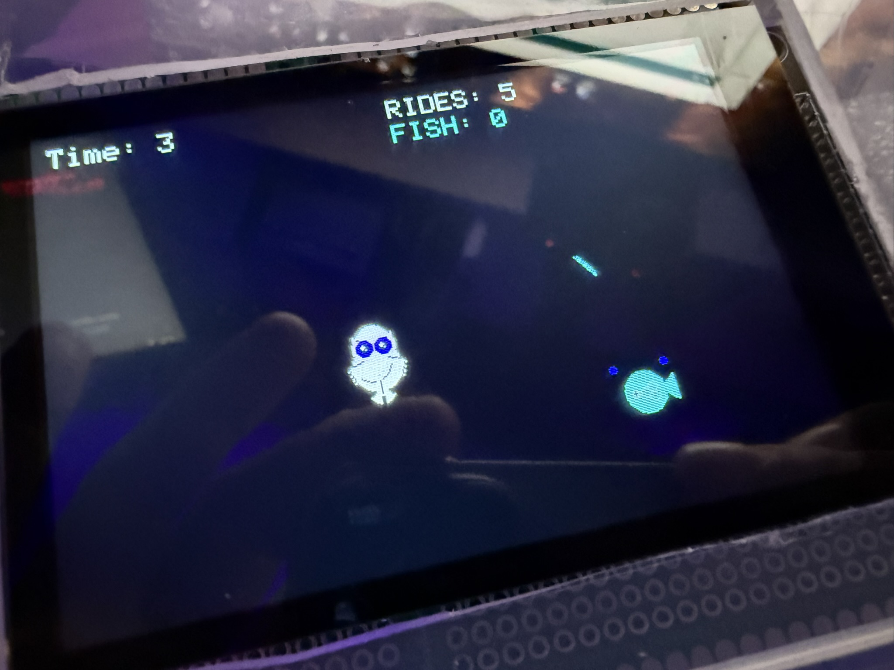 | 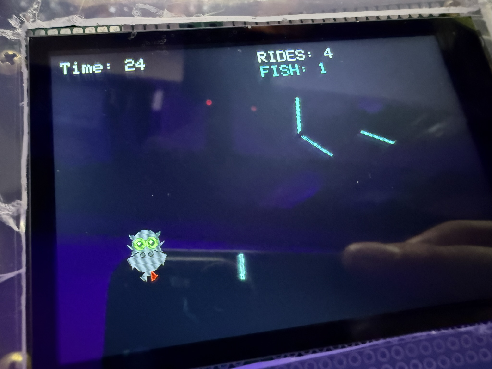 |

### 🐉 Dragons Gameplay
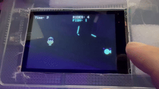

> 🆕 **NEW!** BONK Dragons variant created by Nolan featuring Toothless (Night Fury) with green eyes and Light Fury! Collect fish for "RIDES" and shoot plasma blasts across the screen!

## 👥 Game Modes

- 🕹️ **Single Player**: Test your reflexes in solo mode - perfect for practice and personal bests
- 🤝 **Two Player**: Compete against a friend to see who can get the highest score - ultimate showdown!

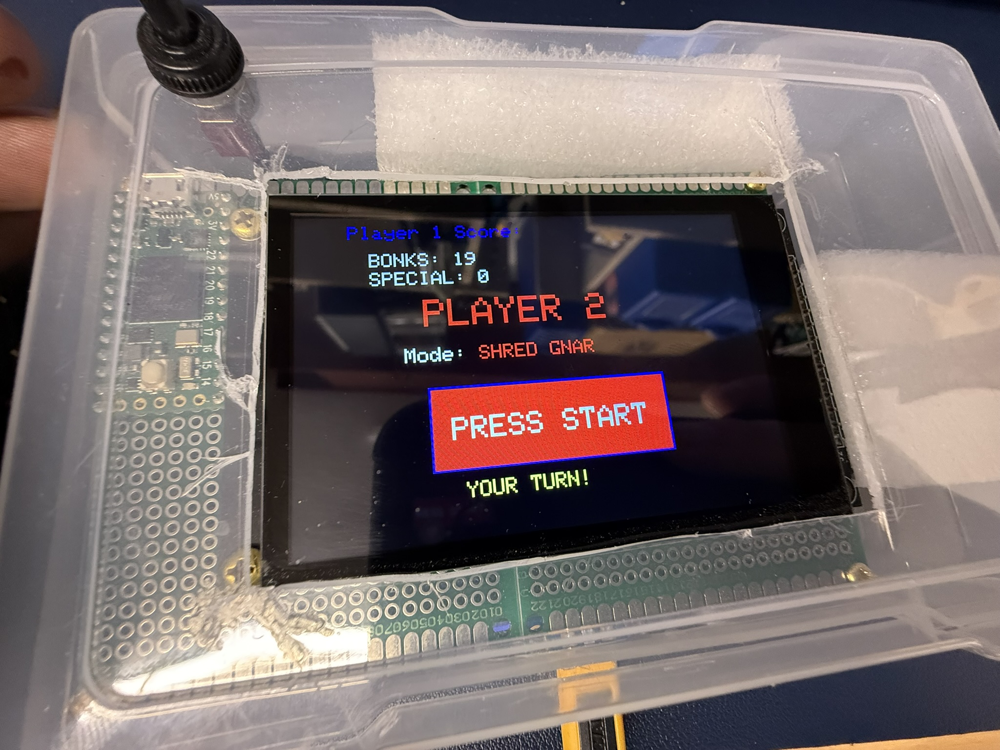 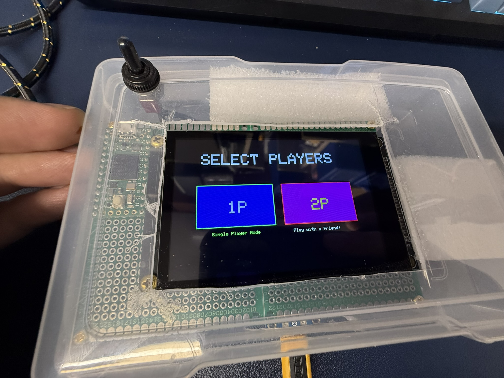

## ⚡ Difficulty Levels

Choose between different difficulty settings to match your skill level:

- 🟢 **Easy Mode**: Kid-friendly! Designed for beginners with a "grace period" that gives players extra time to react
- 🔴 **Shred Gnar Mode**: CHALLENGE ACCEPTED! Advanced mode with progressively faster gameplay, smaller targets, and intense frenzy mode

The game provides satisfying visual feedback with a green flash and center dot to register a successful "BONK" when targets are hit! 💥

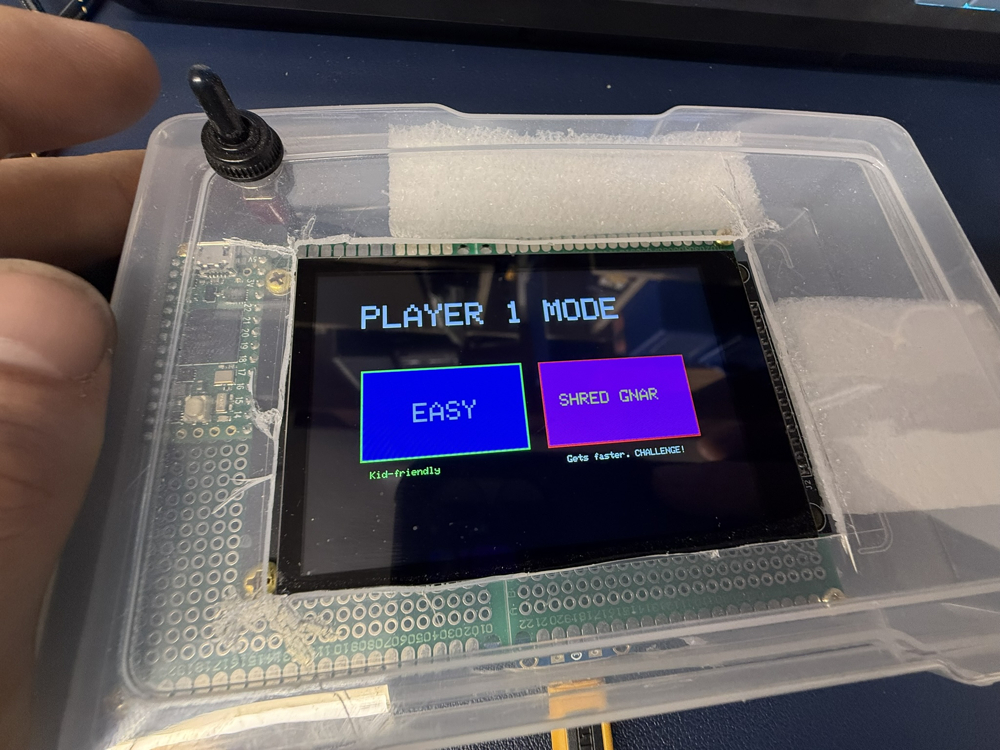

## 🎯 Game Mechanics

Players tap appearing objects on the screen to score points. The faster you tap, the more points you earn! ⚡

**Special Features:**
- 🎯 **Main Targets**: Chickens, Bunnies, American Flags, Bluey/Bingo, or Dragons (depending on variant)
- ⭐ **Bonus Items**: Special characters appear for extra points - Eggs, Stars, Blue Chickens, Balloons, or Fish!
- ⏱️ **45-Second Timer**: Score as many points as possible before time runs out
- 🎆 **Visual Effects**: Explosions, fireworks, confetti, plasma blasts, and satisfying feedback for every hit

### 📊 Scoring and Results

At the end of each game, celebrate your achievements with detailed results including:
- 🏆 Regular target score
- ⭐ Special item bonus points  
- 🎯 Total combined score
- 🏅 Win/lose determination based on difficulty thresholds

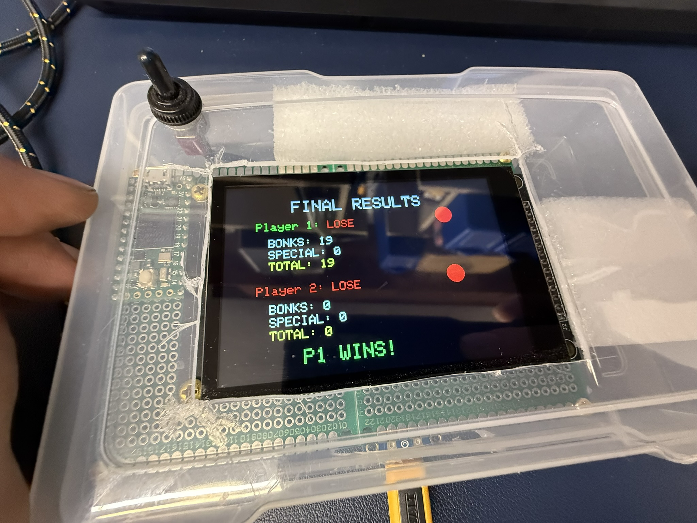

## 📁 File Structure

- 🚀 `BONK_Completed_REV4.0Frenzy.ino`: Base game with "Frenzy" mode
- 👥 `BONK_Completed_REV5.0_Multiplayer.ino`: Enhanced version with multiplayer support  
- 🇺🇸 `BONK_Completed_REV6.0_Patriots.ino`: Patriots variant with American flags and fireworks
- 🐕 `BONK_Completed_REV7.0_Bluey/`: Bluey variant featuring characters from the popular show
- 🐉 `BONK_Completed_REV8.0_Dragons/`: **NEW!** How to Train Your Dragon variant with plasma blasts!
- 🔧 `BONK_Fixed.ino`: Stable bug-fixed version
- 📱 `fixed.ino`: Alternative fixed version

## 🎮 Menu System

The game features an intuitive touch-based menu system with smooth navigation through:
- 🎯 Game variant selection (Chicken/Bunny/Patriots/Bluey/Dragons)
- 👥 Player mode selection (1P/2P)  
- ⚡ Difficulty selection per player
- 🚀 Ready-to-play confirmation screens

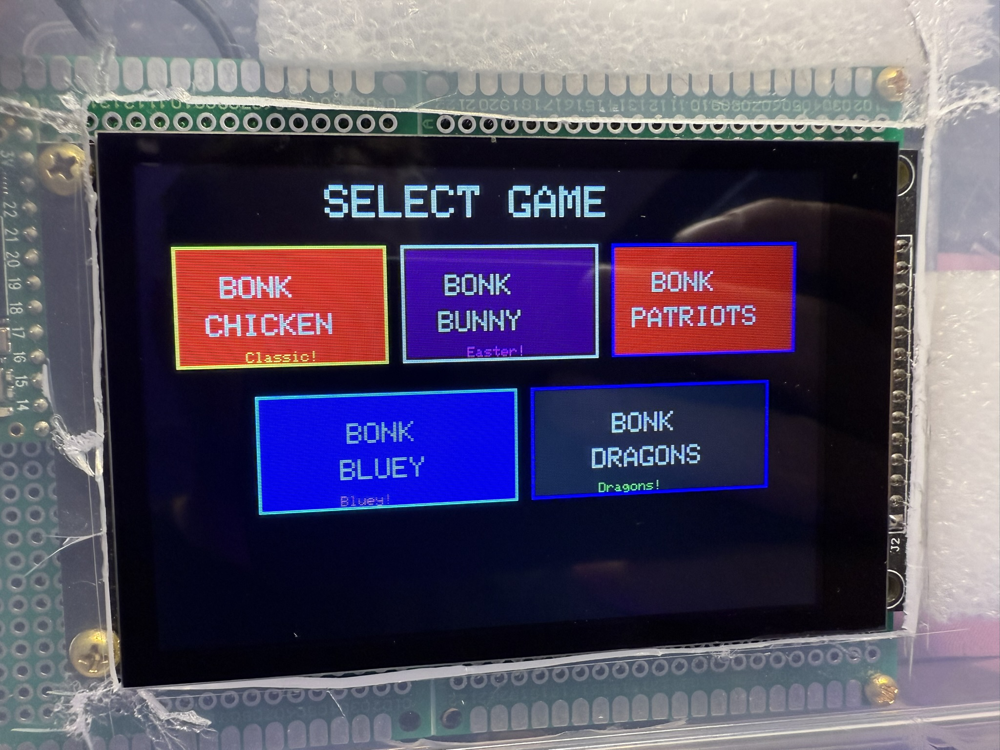

## 🛠️ Installation

1. 📚 **Install the required libraries:**
   - `SPI` - Serial Peripheral Interface
   - `ILI9488_t3` - TFT display driver  
   - `Wire` - I2C communication
   - `FT6236G` - Touch controller driver

2. 🔌 **Connect your hardware** according to the pin definitions in the code:
   ```cpp
   // TFT display pins
   #define TFT_CS     10  // Chip Select
   #define TFT_DC     9   // Data/Command
   #define TFT_RST    8   // Reset

   // Touch panel pins
   #define CTP_INT    5   // Interrupt
   #define CTP_RST    7   // Reset  
   #define CTP_ADDR   0x38  // I2C Address
   ```

3. 🚀 **Upload** your preferred `.ino` file to your microcontroller and start BONKing!

## 🎨 Create Your Own Variant!

Want to create your own BONK variant with your kids? Check out our guides:
- 📖 [Creative Sessions Guide](CREATIVE_SESSIONS_GUIDE.md) - Complete framework for coding with children
- 📝 [Bluey Variant Example](CREATIVE_SESSION_EXAMPLE_BLUEY.md) - Real example from Daisy's session

## 💻 Development

This game was developed to showcase the amazing interactive capabilities of touchscreen displays with Arduino-compatible microcontrollers! 

**Technical Features:**
- 🎯 State-based game flow management
- 👆 Precise touch input processing  
- 🎨 Dynamic graphics rendering
- 📊 Real-time score tracking
- ⏱️ Accurate timer functionality
- 🎮 Multiple game modes and difficulty levels
- 🎆 Custom visual effects (explosions/fireworks)

## ⚖️ Legal Disclaimers

### Bluey Variant Copyright Notice
The BONK Bluey variant is **FAN ART** created for educational and recreational purposes only. Bluey™ and all related characters are trademarks of Ludo Studio Pty Ltd and are used here under fair use for non-commercial, educational purposes. This variant is not affiliated with, endorsed by, or sponsored by Ludo Studio, the Australian Broadcasting Corporation (ABC), or BBC Studios. No copyright infringement is intended.

### How to Train Your Dragon Variant Copyright Notice
The BONK Dragons variant is **FAN ART** created for educational and recreational purposes only. How to Train Your Dragon™, Toothless™, Light Fury™ and all related characters are trademarks of DreamWorks Animation LLC and are used here under fair use for non-commercial, educational purposes. This variant is not affiliated with, endorsed by, or sponsored by DreamWorks Animation, Universal Pictures, or NBCUniversal. No copyright infringement is intended.

**These variants are strictly for:**
- Personal educational use
- Non-commercial recreational enjoyment
- Learning programming concepts

**NOT for any commercial use whatsoever.**

## 📄 License

This project is open source and available for **educational and recreational purposes only**. 🎓

**✅ Permitted Uses:**
- 📚 Educational and learning projects
- 🎮 Personal recreational enjoyment  
- 🔬 Non-commercial research and development
- 🎓 Academic coursework and projects
- 🤝 Open source community contributions

**❌ Commercial Use Prohibited** - See [LICENSE](LICENSE) file for complete terms.

⚠️ **No Warranties** - Use at your own risk, especially when working with electronic hardware!

## 👨‍💻 Credits

Created with ❤️ by **VonHoltenCodes**

> 🎮 **Happy BONKing!** Whether you're celebrating Easter with bunnies, enjoying classic chicken action, showing your patriotic spirit with flags and fireworks, or dancing along with Bluey and Bingo - there's a BONK variant for every occasion! 🎉